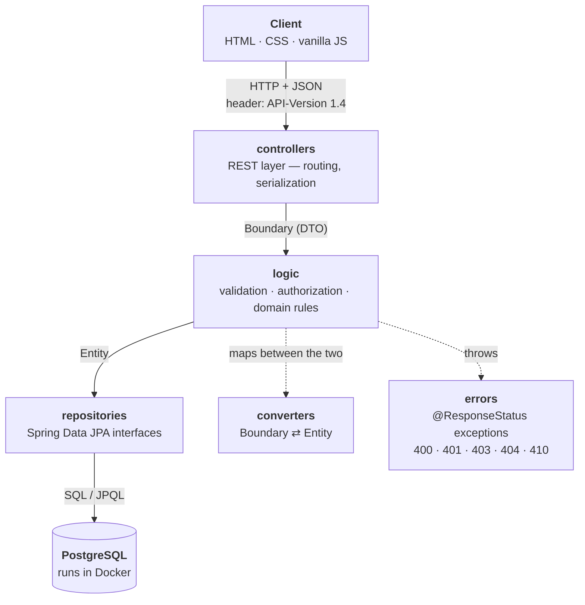
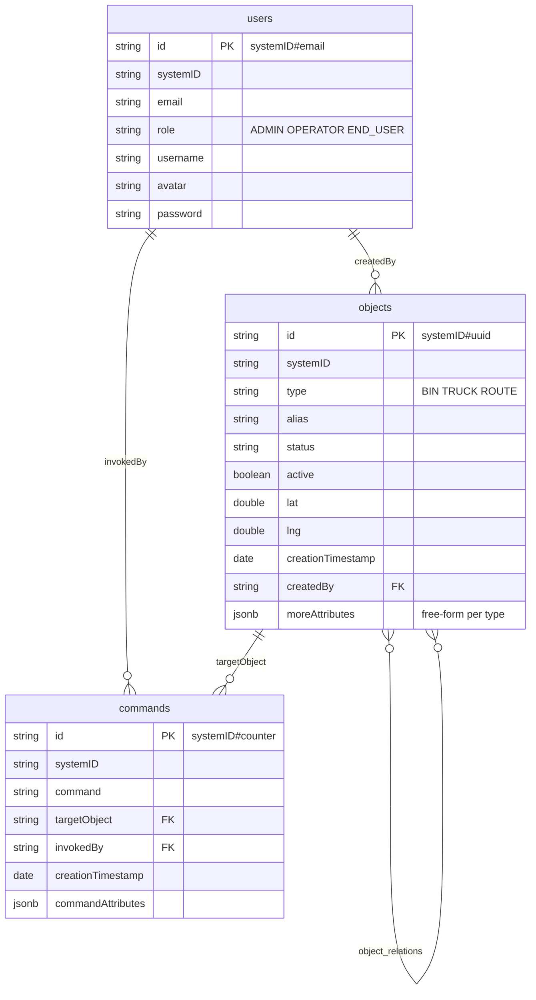
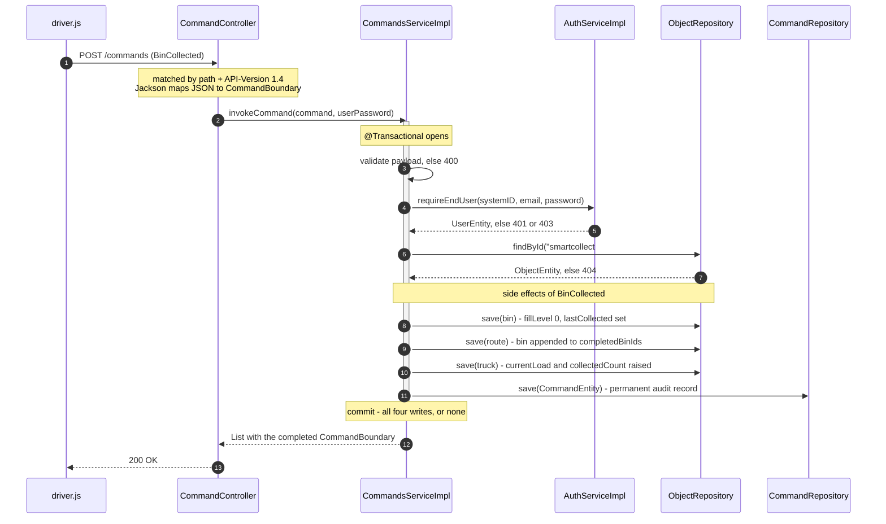

# SmartCollect — Smart Waste Collection System

> **Final project for the Integrative Software Engineering course** (`il.ac.afeka.integrative`), version `1.4`.
> Built by a student team. The brief: design and build a complete client–server system on top of a
> **generic Users / Objects / Commands data model**, where a single object model has to express an
> entire application domain without dedicated tables per entity type.

A Spring Boot REST API for managing smart waste collection operations. The system coordinates
**bins**, **trucks** and **collection routes** through one unified API, and ships with a
vanilla-JS web client for each of its three user roles.

---

## What it does

A municipal waste operation has three moving parts, and SmartCollect models all three as the
*same* kind of record:

| Domain entity | Modelled as | Holds |
|---|---|---|
| **Bin** | `Object` with `type = "BIN"` | fill level, waste type, capacity, address, error status |
| **Truck** | `Object` with `type = "TRUCK"` | plate number, assigned driver, current load, collected count |
| **Route** | `Object` with `type = "ROUTE"` | assigned truck & driver, ordered bin list, completion progress |

A **route is the parent of its bins** — expressed with a generic parent/child relation rather than a
foreign key named "route_id". Adding a fourth entity type tomorrow requires no schema change and no
new endpoint.

The three roles map onto the real workflow:

- **Operator** — creates bins, trucks and routes, and binds bins to a route
- **Driver** (`END_USER`) — drives a route and reports what happened via **commands**
- **Admin** — system maintenance: export and purge

---

## Table of contents

- [Tech Stack](#tech-stack)
- [Architecture](#architecture)
- [Data Model](#data-model)
- [Roles & Permissions](#roles--permissions)
- [Request Lifecycle — a worked example](#request-lifecycle--a-worked-example)
- [Getting Started](#getting-started)
- [Frontend](#frontend)
- [API Overview](#api-overview)
- [JSON Contracts](#json-contracts)
- [Key Design Decisions](#key-design-decisions)
- [Test Structure](#test-structure)
- [PostgreSQL Configuration](#postgresql-configuration)
- [Deployment](#deployment)
- [Project Info](#project-info)

---

## Tech Stack

| Layer | Technology |
|---|---|
| Language | Java 25 |
| Framework | Spring Boot 4.1.0 |
| Database | PostgreSQL (via Docker Compose) - originally MongoDB, migrated mid-project |
| Build Tool | Gradle 9 |
| API Docs | OpenAPI / Swagger UI |
| Testing | JUnit 5 · AssertJ · TestContainers |

---

## Architecture

Classic **N-Tier**: every request travels down the same four layers, and no layer reaches past its
neighbour. The `converters` package is the seam that keeps the two object worlds apart — DTOs
(`boundaries`) never reach the database, and entities (`data`) never reach the client.



### Packages under `src/main/java/ambient_invisible_intelligence`

| Package | Contents | Responsibility |
|---|---|---|
| `controllers` | 4 `@RestController` classes | The REST surface. Deliberately thin — validates nothing, delegates immediately to a service. |
| `logic` | 4 interfaces | The service contracts the controllers depend on. |
| `logic/impl` | 4 `@Service` classes | All business logic: input validation, role enforcement, ID generation, and the command side effects. |
| `repositories` | 3 interfaces extending `JpaRepository` | Data access. No implementations — Spring Data generates them at runtime from method names and `@Query`. |
| `data` | 3 `@Entity` classes + `UserRole` enum | The database tables, including `jsonb` columns and the self-referencing many-to-many relation. |
| `boundaries` | 11 plain POJOs | The DTOs that travel as JSON. No logic, no JPA annotations. |
| `converters` | 3 `@Component` classes | `toBoundary()` / `toEntity()` in both directions. One place to change a mapping. |
| `errors` | 5 `RuntimeException` classes | Each annotated `@ResponseStatus`, so throwing one deep in a service becomes the right HTTP status — no `try/catch` in any controller. |

Two files sit at the package root:

- **`Application.java`** — the `@SpringBootApplication` entry point.
- **`SmartCollectDemoInit.java`** — a `CommandLineRunner` marked `@Profile("initDemoes")` that seeds
  demo users, bins, trucks and routes. Toggled by configuration alone, with no `if` in the code.

---

## Data Model

Three tables, plus one join table that makes the whole generic model work.



Three things worth pointing out:

1. **`moreAttributes` is a `jsonb` column.** Mapped with `@JdbcTypeCode(SqlTypes.JSON)` onto a
   `Map<String, Object>`. This is what lets a BIN store `fillLevel` and a TRUCK store `plateNumber`
   in the same table — schema-less flexibility inside a relational database.
2. **`object_relations` is a self-referencing many-to-many** (`parentObject` ↔ `childObject`). An
   object can be a parent of some objects and a child of others. In practice: a ROUTE is the parent,
   its BINs are the children.
3. **Primary keys are composite strings**, `systemID#localId`. One string column carries both the
   originating system and the local identifier.

---

## Roles & Permissions

Enforced in `AuthServiceImpl`, which every service method calls on its first line. There is no
Spring Security in this project — authorization is explicit and readable.

| Operation | ADMIN | OPERATOR | END_USER (driver) |
|---|:---:|:---:|:---:|
| Create / update objects, bind child to parent | ✗ | ✓ | ✗ |
| Read objects, children, parents, all searches | ✗ | ✓ (all) | ✓ (`active` only) |
| Invoke a command — `POST /commands` | ✗ | ✗ | ✓ |
| Admin endpoints — `/admin/*` | ✓ | ✗ | ✗ |

Failing a check produces `401 Unauthorized` (bad credentials) or `403 Forbidden` (authenticated but
wrong role). An `END_USER` requesting an inactive object gets `404` rather than `403`, so the API
does not leak the existence of records that role cannot see.

---

## Request Lifecycle — a worked example

The most interesting flow in the system: a driver marks a bin as collected. The driver does **not**
update three objects; they state one *intent*, and the server derives every consequence inside a
single transaction.



The route is found through `bin.getParents()` — a lazy-loaded traversal of the many-to-many relation
that only works because the whole method runs inside `@Transactional`. The truck is then found
through `assignedTruckId` stored in the route's `jsonb`.

Three commands carry side effects:

| Command | Effect |
|---|---|
| `BinCollected` | Empties the bin · marks it complete on its route · adds weight and count to the truck |
| `BinErrorReported` | Flags the bin for maintenance · removes it from its route's bin list |
| `TruckArrivedAtDepot` | Moves route and truck to `returning` and stamps the completion time |

Any other command name is accepted and recorded in history, but produces no side effects.

---

## Getting Started

### Prerequisites
- Docker Desktop (running)
- JDK 25

### Run the application

Start PostgreSQL:
```bash
docker compose up -d
```

Start the server:
```bash
./gradlew bootRun
```

The server starts on **port 8084**.

| What | Where |
|---|---|
| Web client | `http://localhost:8084/index.html` |
| Swagger UI | `http://localhost:8084/swagger-ui.html` |
| H2 console (debug) | `http://localhost:8084/h2-console` |

On first run the `initDemoes` profile seeds a demo dataset — **7 users, 5 trucks and 70 bins**
spread over real Tel Aviv streets. Sign in as the operator with `op1@sc.com` / `Oper1!7`.

> **Routes are not seeded.** Collection routes are built by the operator: open the operator
> dashboard, pick a set of bins, assign a truck and a driver, and create the route — the bins are
> then bound to it as children. Until a route exists the driver dashboard has nothing to show, so
> create one before signing in as a driver (`dan@sc.com` / `Driver1!`) to see the collection flow.

> For a full production deployment walkthrough (DDL-auto modes, first-run vs. subsequent-run config, seeded demo credentials), see [`INSTRUCTIONS.MD`](INSTRUCTIONS.MD).

### Run the tests
```bash
./gradlew test
```

Tests use TestContainers - Docker must be running. The test suite spins up its own isolated PostgreSQL container automatically.

---

## Frontend

Static vanilla HTML/CSS/JS, served directly by Spring Boot from `src/main/resources/static` - no build step, no framework, no `package.json`.

| Page | Purpose |
|---|---|
| `index.html` | Login |
| `admin.html` | Admin console |
| `operator.html` | Operator dashboard |
| `driver.html` | Driver route view |

```
static/
├── index.html / admin.html / operator.html / driver.html
├── css/style.css
└── js/
    ├── core/       - config, HTTP client, session, UI helpers (loaded first)
    ├── services/   - userService, objectService, commandService (wrap the REST API)
    └── pages/      - per-page logic (app, admin, operator, driver)
```

The client mirrors the server's layering: `core` (infrastructure) → `services` (data access) →
`pages` (presentation). Scripts are plain `<script>` tags loaded in a fixed order; each service file
attaches its methods onto one global `api` object via `Object.assign`.

Maps use **Leaflet**, charts use **Chart.js**, both loaded from a CDN.

---

## API Overview

All endpoints require the `API-Version: 1.4` header.
Base path: `/ambient-invisible-intelligence`

### Users - `/users`

| Method | Path | Description |
|---|---|---|
| POST | `/users` | Register a new user |
| GET | `/users/login/{systemID}/{userEmail}?password=` | Login |
| PUT | `/users/{systemID}/{userEmail}?password=` | Update user profile |

### Objects - `/objects`

| Method | Path | Description |
|---|---|---|
| POST | `/objects?userPassword=` | Create an object (Bin / Truck / Route) |
| GET | `/objects/{systemID}/{objectId}?userSystemID=&userEmail=&userPassword=` | Get object by ID |
| GET | `/objects?userSystemID=&userEmail=&userPassword=&size=&page=` | Get all objects (paginated) |
| PUT | `/objects/{systemID}/{objectId}?userSystemID=&userEmail=&userPassword=` | Update an object |
| PUT | `/objects/{parentSystemID}/{parentObjectId}/children?...` | Bind child to parent |
| GET | `/objects/{parentSystemID}/{parentObjectId}/children?...&size=&page=` | Get children of an object |
| GET | `/objects/{childSystemID}/{childObjectId}/parents?...&size=&page=` | Get parents of an object |
| GET | `/objects/search/byAlias/{alias}?...` | Search objects by exact alias |
| GET | `/objects/search/byAliasPattern/{pattern}?...` | Search objects by alias pattern |
| GET | `/objects/search/byType/{type}?...` | Search objects by type |
| GET | `/objects/search/byStatus/{status}?...` | Search objects by status |
| GET | `/objects/search/byLocation/{lat}/{lng}/{distance}?units=&...` | Search objects within a distance of a location |

> Non-paginated `@Deprecated` variants of the get-all/children/parents endpoints are also kept for backward compatibility.

### Commands - `/commands`

| Method | Path | Description |
|---|---|---|
| POST | `/commands?userPassword=` | Invoke a command on a target object |

### Admin - `/admin`

| Method | Path | Description |
|---|---|---|
| DELETE | `/admin/users?userSystemID=&userEmail=&userPassword=` | Delete all users |
| DELETE | `/admin/objects?...` | Delete all objects |
| DELETE | `/admin/commands?...` | Delete all commands |
| GET | `/admin/users?...&size=&page=` | Export all users (paginated) |
| GET | `/admin/commands?...&size=&page=` | Export all commands history (paginated) |

> Non-paginated `@Deprecated` variants also exist for `/admin/users` and `/admin/commands`.

---

## JSON Contracts

### UserWithPasswordBoundary (request - create/update)
```json
{
  "email": "user@example.com",
  "password": "Secur3!",
  "role": "END_USER",
  "username": "John Doe",
  "avatar": "J"
}
```
Roles: `ADMIN` · `OPERATOR` · `END_USER`

Password rules: minimum 5 characters, at least one digit, at least one special character.

### UserBoundary (response)
```json
{
  "userId": { "systemID": "smartcollect", "email": "user@example.com" },
  "role": "END_USER",
  "username": "John Doe",
  "avatar": "J"
}
```

### ObjectBoundary
```json
{
  "id": { "systemID": "smartcollect", "objectId": "<uuid>" },
  "type": "BIN",
  "alias": "Bin on Main St",
  "status": "active",
  "active": true,
  "creationTimestamp": "2026-06-09T12:00:00Z",
  "location": { "lat": 32.114, "lng": 34.796 },
  "createdBy": { "userId": { "systemID": "smartcollect", "email": "user@example.com" } },
  "objectDetails": {}
}
```

`objectDetails` is a free-form map (`Map<String, Object>`) - there are no dedicated BIN/TRUCK/ROUTE boundary classes, just a `type` string convention with these commonly-used keys:

**BIN** `objectDetails`:
```json
{
  "fillLevel": 0,
  "binType": "general",
  "capacity": 1100,
  "address": "123 Main St",
  "lastCollected": null,
  "status": "active",
  "errorStatus": null
}
```
`binType`: `general` · `plastic` · `paper` · `glass` · `organic`
`errorStatus`: `null` · `damaged` · `blocked` · `missed`

**TRUCK** `objectDetails`:
```json
{
  "plateNumber": "12-345-67",
  "driverEmail": null,
  "driverName": null,
  "status": "available",
  "currentRouteId": null,
  "collectedCount": 0,
  "totalCapacity": 8000,
  "currentLoad": 0
}
```

**ROUTE** `objectDetails`:
```json
{
  "assignedTruckId": "truck-uuid",
  "assignedDriverEmail": "driver@example.com",
  "assignedDriverName": "Driver Name",
  "status": "planned",
  "binIds": ["bin-uuid-1", "bin-uuid-2"],
  "completedBinIds": [],
  "scheduledDate": "2026-06-08",
  "startedAt": null,
  "completedAt": null,
  "approvedAt": null
}
```
`status`: `planned` · `in_progress` · `returning` · `completed` · `cancelled`

### ObjectChildIdBoundary (request - bind child to parent)
```json
{
  "childId": {
    "systemID": "smartcollect",
    "objectId": "<uuid>"
  }
}
```

### CommandBoundary
```json
{
  "command": "BinCollected",
  "targetObject": { "id": { "systemID": "smartcollect", "objectId": "<uuid>" } },
  "invokedBy": { "userId": { "systemID": "smartcollect", "email": "user@example.com" } },
  "commandAttributes": {}
}
```

---

## Key Design Decisions

**A generic object model instead of a table per entity.** `objects` carries a `type` discriminator
and a `jsonb` column. Bins, trucks and routes differ only in their `type` value and the keys inside
`objectDetails`. New entity types cost nothing.

**Relationships are generic too.** A route "contains" bins through a self-referencing many-to-many
join table, not a route-specific foreign key. The same mechanism would express any other hierarchy.

**The DTO layer is decoupled from persistence.** `ObjectBoundary` hides its composite key with
`@JsonIgnore` and exposes `{ systemID, objectId }` under the JSON name `id` via `@JsonProperty("id")`.
The wire format is therefore free to differ from the storage format — which is what made it possible
to migrate the database from MongoDB to PostgreSQL mid-project while touching only `data` and
`repositories`.

**API versioning is built into routing.** Controllers declare `version = "1.4+"`, and
`spring.mvc.apiversion.use.header=API-Version` makes Spring select handlers by header. Superseded
endpoints are still mapped — distinguished by `params = {"!size", "!page"}` — and answer
`410 Gone` with an explicit upgrade message rather than a confusing `404`.

**Commands over CRUD for domain events.** Clients that would otherwise need three coordinated writes
send one command; the server applies every side effect atomically and keeps the command as an audit
record.

### Known limitations

Honest notes on what a production version would change:

| Area | Current | Would become |
|---|---|---|
| Password storage | Plain text | BCrypt hash + salt |
| Authentication | Credentials repeated on every request as query params | JWT or an `HttpOnly` session cookie |
| Authorization | Manual `require...` call per method | Spring Security with `@PreAuthorize` |
| Role escalation | The operator dashboard promotes itself to `ADMIN` via `PUT /users`, calls an admin-only endpoint, then demotes itself — because `/admin/users` is the only way to list drivers | A dedicated endpoint that returns drivers to an operator, so no client ever needs a higher role |
| Command IDs | `AtomicLong`, resets on restart | UUID or a database sequence |
| Location search | Bounding box in degrees | PostGIS or a Haversine query |

---

## Test Structure

```
src/test/java/ambient_invisible_intelligence/
├── TestContainersConfiguration.java   - shared PostgreSQL container setup
├── admin/
│   └── AdminAndRoleMatrixTests.java   - admin endpoints + role/permission matrix
├── apiversion/
│   └── ApiVersionTests.java           - API-Version header enforcement
├── commands/
│   └── CommandTests.java              - command invocation
├── objects/
│   ├── ObjectCrudTests.java           - create, read, update
│   ├── ObjectRelationsTests.java      - parent/child binding
│   └── ObjectSearchTests.java         - search by alias/type/status/location
├── users/
│   └── UserTests.java                 - registration, login, update
├── support/
│   ├── BaseIntegrationTest.java       - shared base class for integration tests
│   └── TestConstants.java             - shared constants
└── rest/                              - HTTP client interfaces and config
    ├── UserApi.java / UserApiConfig.java
    ├── ObjectApi.java / ObjectApiConfig.java
    ├── CommandApi.java / CommandApiConfig.java
    └── AdminApi.java / AdminApiConfig.java
```

Every test runs against a real PostgreSQL instance in a throwaway container, so no test depends on
the developer's local database or on the order tests happen to run in.

---

## PostgreSQL Configuration

```
Database: smartcollect
User: postgres
Password: set via POSTGRES_PASSWORD env var (defaults to "secret")
```

Managed via `compose.yaml` and `spring-boot-docker-compose` - Spring Boot auto-connects on startup, no manual `spring.datasource.*` config needed. Spring reads `compose.yaml`, starts the container, discovers the randomly assigned port and builds the `DataSource` itself.

> Originally built on MongoDB; migrated to PostgreSQL mid-project as part of learning relational modeling with JPA/Hibernate.

---

## Deployment

The repository ships everything needed to run the whole stack on a single Linux
host. `compose.yaml` stays as the development file (PostgreSQL only, with the
application running on the host); `docker-compose.prod.yml` runs all three
services in containers.

| File | Role |
|---|---|
| `Dockerfile` | Multi-stage build — `eclipse-temurin:25-jdk` builds the jar, `25-jre` runs it as a non-root user |
| `docker-compose.prod.yml` | PostgreSQL + application + Caddy |
| `Caddyfile` | TLS termination and reverse proxy |
| `src/main/resources/application-prod.properties` | Production overrides, activated by `SPRING_PROFILES_ACTIVE=prod` |

### Deploy

```bash
git clone https://github.com/alon1406/SmartCollect.git && cd SmartCollect
cp .env.example .env          # set DB_PASSWORD and DOMAIN
docker compose -f docker-compose.prod.yml up -d --build
```

Caddy requests a Let's Encrypt certificate on first start, so the domain's `A`
record must already point at the host. Only ports 80 and 443 need to be open —
PostgreSQL and the application are reachable only on the internal network.

### Notes on running this publicly

**The demo resets itself.** The production profile keeps `ddl-auto=create`, so
every restart drops the schema and `initDemoes` re-seeds the same fixed dataset.
Anything a visitor creates or deletes is gone on the next start. Because the
container otherwise runs for weeks, a nightly restart is what actually triggers
the reset:

```
0 4 * * *  cd /opt/smartcollect && docker compose -f docker-compose.prod.yml restart app
```

**Two things are locked down for a public deployment**, both listed under
[Known limitations](#known-limitations):

- `POST /users` silently downgrades a requested `ADMIN` role to `END_USER`, so
  nobody can self-register into the admin endpoints. Seeded admin accounts are
  unaffected — the seeder calls the service layer directly.
- Caddy returns `403` for `DELETE /ambient-invisible-intelligence/admin/*`, so
  the bulk-delete routes cannot be reached from outside.

---

## Project Info

- **Group**: `il.ac.afeka.integrative`
- **Version**: `1.4`
- **System ID**: `smartcollect`

The system ID is not hard-coded in the Java services — it is read from `spring.application.name` and
injected with `@Value`, so changing it is a one-line configuration change.
